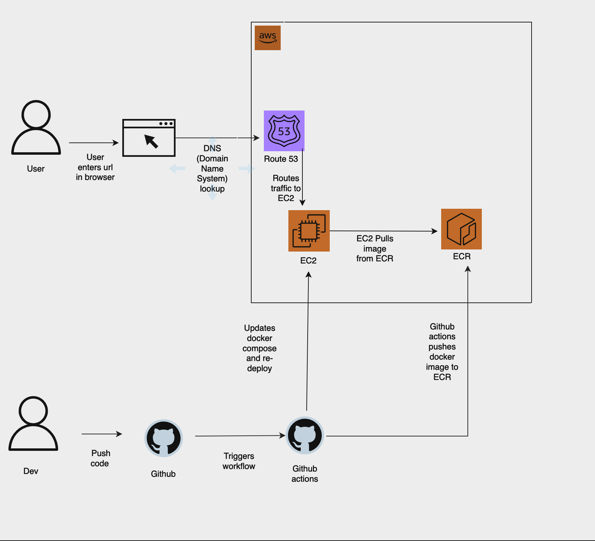

# Django Blog Application Deployment

## Overview

This documentation provides an overview of the deployment process for a Django blog application using an SQL database. The application is containerized using Docker and orchestrated for deployment on AWS infrastructure with automation handled through GitHub Actions.

*Deployment workflow diagram*

## System Architecture

The system uses the following AWS services and development tools:

- **Amazon Route 53**: Manages DNS (Domain Name System) and routes user traffic to the appropriate EC2 instance.
- **Amazon EC2**: Hosts the Docker containers running the Django application.
- **Amazon ECR (Elastic Container Registry)**: Stores the Docker images that are built by GitHub Actions.
- **GitHub Actions**: Automates the deployment pipeline including pushing updates to Amazon ECR and triggering updates on the EC2 instances.

## Deployment Process

1. **Developer Workflow**:
    - Developers write and test code for the Django blog application locally.
    - Changes are committed and pushed to the GitHub repository, which is configured with GitHub Actions for continuous integration.

2. **GitHub Actions**:
    - On a push to the repository, GitHub Actions workflows are triggered.
    - The workflows include steps to build the Docker image for the Django application which includes the SQL database setup.

3. **Docker Image Push to ECR**:
    - Once the Docker image is built, GitHub Actions pushes the image to Amazon ECR.

4. **EC2 Deployment**:
    - Amazon EC2 instances are configured to pull the updated Docker image from Amazon ECR.
    - The EC2 instances use Docker Compose to deploy the application, ensuring that the latest version of the blog is running with the SQL database.

5. **User Access**:
    - Users enter the URL of the blog in their browser.
    - DNS lookup is managed by Amazon Route 53 which directs the request to the appropriate EC2 instance where the Dockerized Django blog application is running.

6. **Continuous Delivery**:
    - As new updates are made to the codebase and pushed to the repository, this triggers the GitHub Actions workflow.
    - This results in a new Docker image being pushed to ECR and subsequently pulled by the EC2 instances, ensuring that the deployment is up-to-date with the latest changes.

## Conclusion

The CI/CD pipeline enables continuous updates to the Django blog application with minimal downtime and ensures that the application is scalable and resilient, taking full advantage of AWS services and GitHub Actions for automation.

